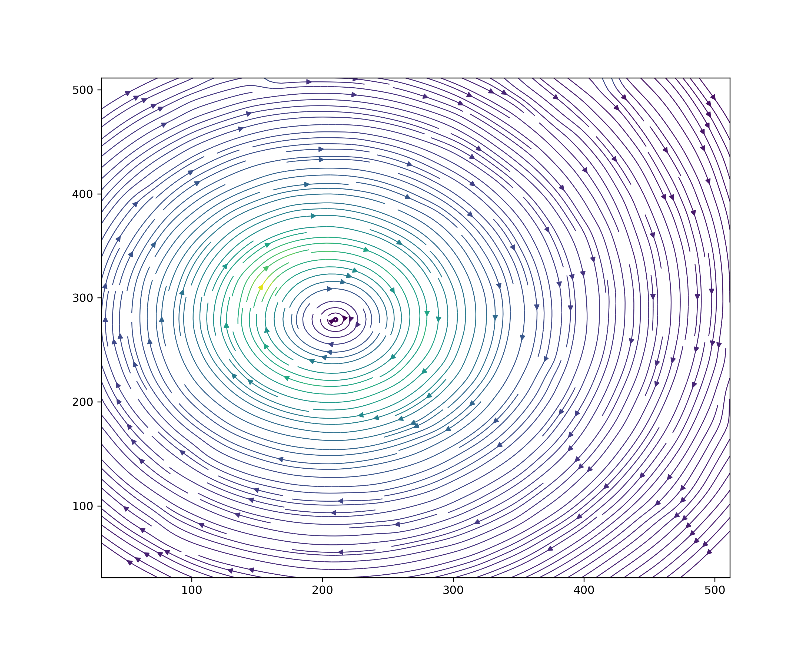
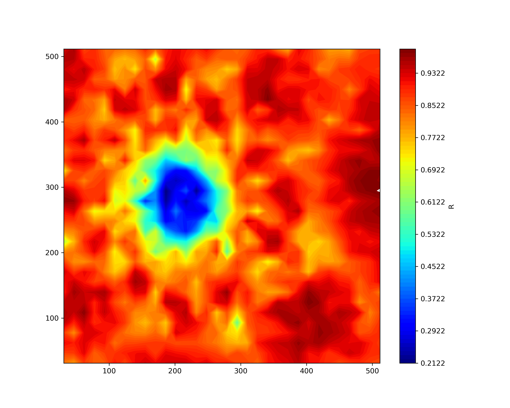
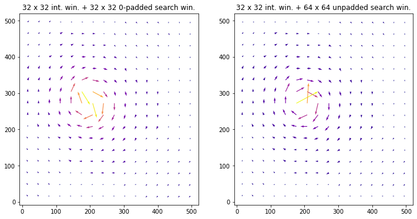

# torchPIV
Particle image velocimetery using pyTorch Conv2D modified module to calculate the Normalized Cross-Correlation between different interrogation windows.
## Motivation
- It was fun.
- Getting to know the ins and outs of the pytorch Conv module.
- Seeing if it would help to make the code get any faster on GPU.
## pyTorch Conv2D
The idea came to my mind when I was reading about  Particle Image Velocimetry algorithm and how similar it was to the current modern Convolutional kernels implemented in machine learning packages such as pyTorch. The convolutional neural networks kernels act the same as an Interrogation window with some differences. There are many different methods for weight initializtions on pyTorch and (mostly random initialization) which would get tuned during the training procedure. But in PIV the Interrogation window had to have fixed pixel values from a frame. 
So it had to be initialized with the pixels defined.

The other difference was the cross-correlation method that was implemented on the conv2D module in pyTorch. 
## Validation 
validation of the results of this algorithm was done with the openPIV software.

The table below shows the results of this algorithm on case B-5 low particle density and small particle of [pivchallenge.com](http://www.pivchallenge.org/pub/#b). 
|        Streamline   | Velocity Field | Correlation Field | 
|:----------:|:-------------:|:-------------:|
|||

The results of the Validation using OpenPIV software with the same Interrogation Window size and same pair of images:

