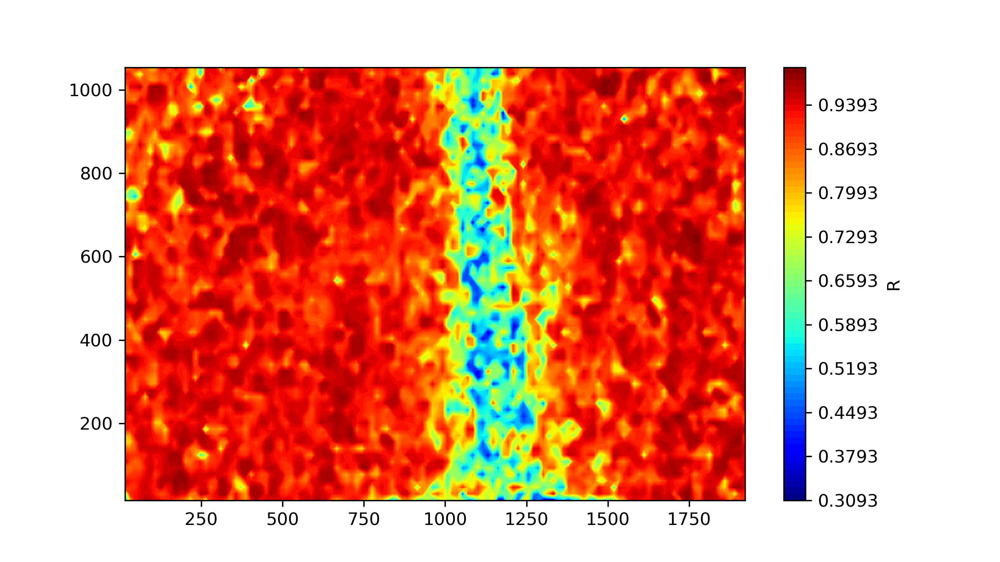
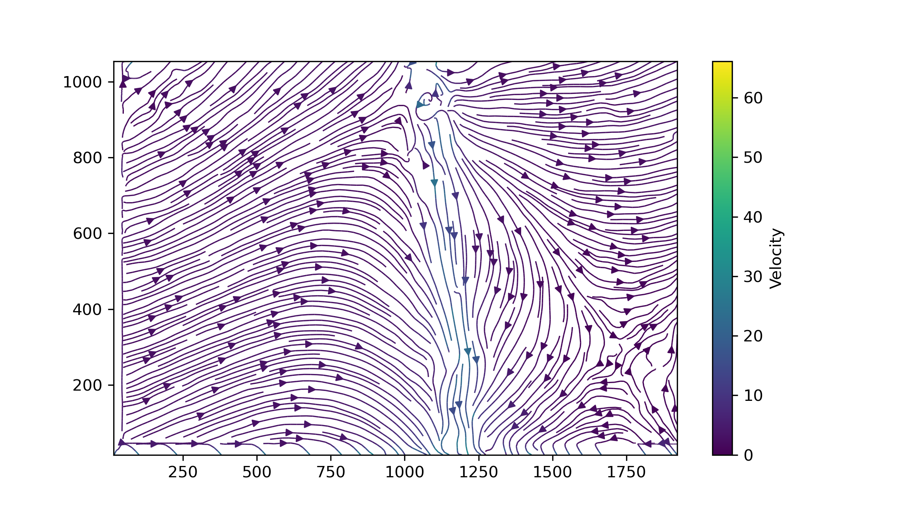
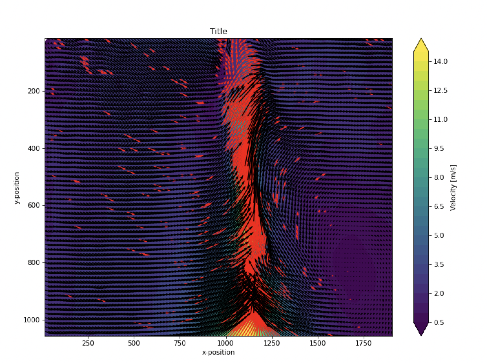

# torchPIV
Particle image velocimetery using pyTorch Conv2D modified module to calculate the Normalized Cross-Correlation between different interrogation windows.
## Validation 
validation of the results of this algorithm was done with the openPIV software.

The table below shows the results of this algorithm on a free jet injection experiment.

|        R Correlation   | Streamline | 
|:----------:|:-------------:| 
||

The results of the Validation using OpenPIV software with the same Interrogation Window size and same pair of images:

